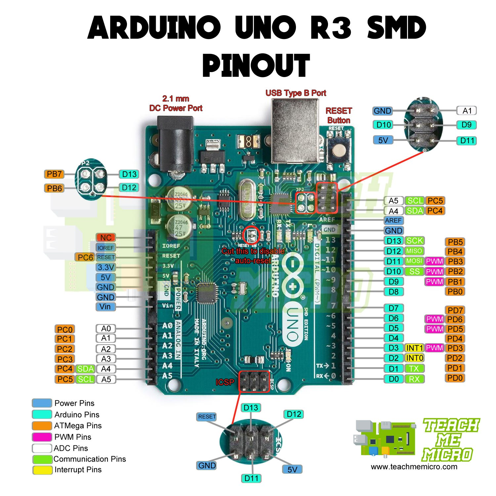
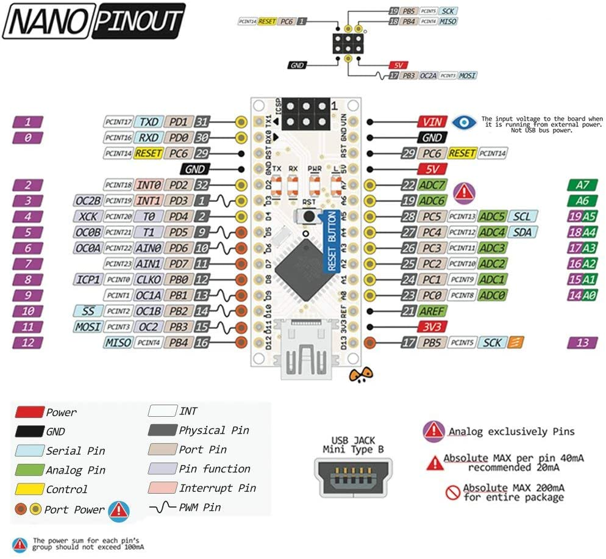

# Arduino

## Arduino info

[Arduino reference](https://www.arduino.cc/reference/en)

### Arduino UNO

[Pinout pdf](docs/pdf/Pinout-UNOrev3_latest.pdf)

## Arduino NANO

[My Arduino UNO](https://www.amazon.com/gp/product/B07WK4VG58/ref=ppx_yo_dt_b_asin_title_o01_s00?ie=UTF8&psc=1)

## YouTube

### Paul McWhorter

[Arduino Tutorial 12: Understanding Potentiometers](https://www.youtube.com/watch?v=PUte1cmJ44A)

### DroneBot workshop

[DroneBot workshop](https://www.youtube.com/channel/UCzml9bXoEM0itbcE96CB03w)

[Blog](https://dronebotworkshop.com/)
