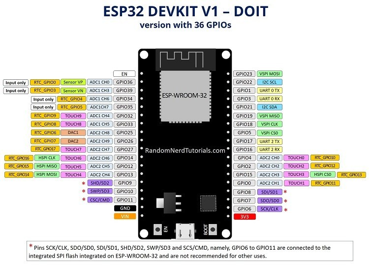

# ESP32

## ESP32 info

[www.espressif.com](https://www.espressif.com/en/products/socs/esp32/overview)

[Getting Started](https://docs.espressif.com/projects/esp-idf/en/latest/esp32/get-started/index.html)

[Pinout Reference](https://randomnerdtutorials.com/esp32-pinout-reference-gpios/)

### Projects

[Courses](https://www.espressif.com/en/ecosystem/iot-college/courses)

[Books](https://www.espressif.com/en/ecosystem/iot-college/books?field_type_tid=13&field_book_language_tid=147)

[Projects](https://www.espressif.com/en/ecosystem/iot-college/projects)

## Setup for Windows machine

### Setup Windows Toolchain from Scratch

[Setup Windows Toolchain from Scratch](https://docs.espressif.com/projects/esp-idf/en/latest/esp32/get-started/windows-setup-scratch.html)

[Updating ESP-IDF tools on Windows](https://docs.espressif.com/projects/esp-idf/en/latest/esp32/get-started/windows-setup-update.html)

## Standard Setup of Toolchain for Linux machine

[Setup Linux Toolchain from Scratch](https://docs.espressif.com/projects/esp-idf/en/latest/esp32/get-started/linux-setup-scratch.html)

## Espressif Eclipse Plugins

[Espressif Eclipse Plugins](https://github.com/espressif/idf-eclipse-plugin)

## Arduino core for the ESP32

[Arduino core for the ESP32](https://github.com/espressif/arduino-esp32)