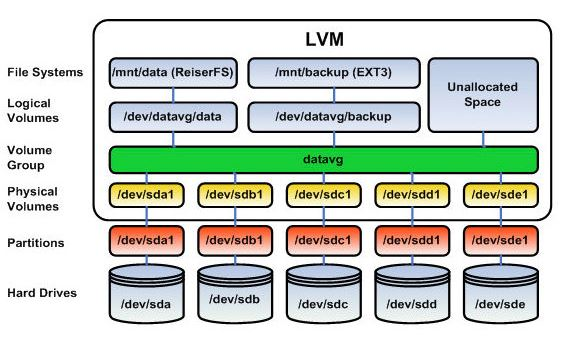
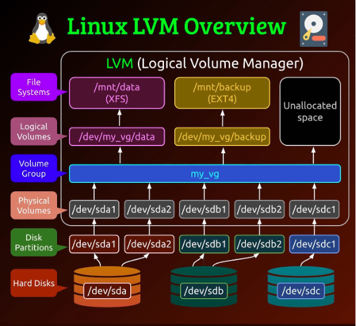

# Logical Volume Management (LVM)
* [Brief Introduction to Logical Volume Manager (LVM) – Concept and example of application](https://www.brainupdaters.net/es/brief-introduction-logical-volumes-lv-concept-example-application-2/)

## Virtual Disk

* Logical Volume Management (LVM)

* Logical Volume Management (LVM)

## Ubuntu Server

### About Logical Volume Management (LVM)

* [About Logical Volume Management (LVM)](https://ubuntu.com/server/docs/about-logical-volume-management-lvm)

## Red Hat

### AOverview of logical volume management

* [Overview of logical volume management](https://docs.redhat.com/en/documentation/red_hat_enterprise_linux/9/html/configuring_and_managing_logical_volumes/overview-of-logical-volume-management_configuring-and-managing-logical-volumes)

