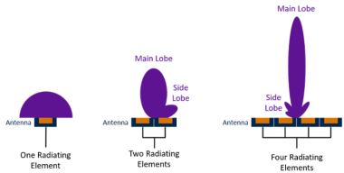
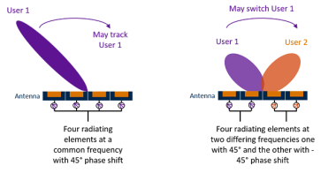

# Beamforming - beam steering

## Beamforming

* Depends on number of Tx/Rx elements.

## Beam steering

* Depends on phase shift of each Tx/Rx elements.

## Articles

* [What is 5G beamforming, beam steering and beam switching with massive MIMO](https://www.metaswitch.com/knowledge-center/reference/what-is-beamforming-beam-steering-and-beam-switching-with-massive-mimo) by metaswitch

* [How 5G Works: Understanding the Difference Between Beamsteering and Beamforming](https://blogs.keysight.com/blogs/inds.entry.html/2020/08/31/how_5g_works_thedi-E9uz.html) by Keysight

YouTube

* [Phased Array Beamforming: Understanding and Prototyping](https://www.youtube.com/watch?v=0hnWfTvETcU) GNU Radio by Jon Kraft from Analog Device
* [A Detailed Introduction to Beamforming](https://youtu.be/HKpQP8H4JRc)
* [An Intuitive Introduction to Beamforming](https://youtu.be/lH5nqLfNVCA)
* [Massive MIMO and Beam Forming](https://youtu.be/Pa1Y_6FwmAg)
