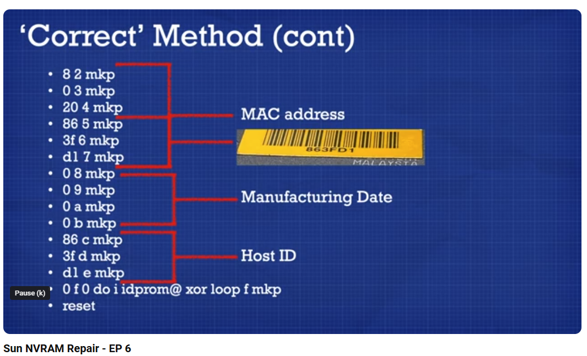

# NVRAM - IDPROM Reset

## Method 1

| YouTube Video           | User                  | MAC Address          |
| ----------------------- | --------------------- | :----------: |
| Sun NVRAM Repair - EP 6 | [link](https://www.youtube.com/watch?v=k4QPBCS7BL8) | 863FD1   |



```sh
ok set-defaults
ok setenv diag-switch? false
ok 1  0 mkp
ok 80 1 mkp or real-machine-type 1 mkp
ok 8  2 mkp
ok 0  3 mkp
ok 20 4 mkp
ok 86 5 mkp 
ok 3f 6 mkp 
ok d1 7 mkp 
ok 0  8 mkp 
ok 0  9 mkp 
ok 0  a mkp 
ok 0  b mkp 
ok 86 c mkp 
ok 3f d mkp 
ok d1 e mkp 
ok 0 f 0 do i idprom@ xor loop f mkp
reset
```

## Method 2

Alternative method using MAC address: `8 0 20 86 3f d1` and hostid: `863fd1`

```sh
ok set-defaults
ok setenv diag-switch? false
ok 1  0 mkp
ok real-machine-type 1 mkp
ok 8 0 20 86 3f d1 863fd1 mkpl <return> <ctrl-d> <ctrl-r>
ok .idprom
ok reset
```
