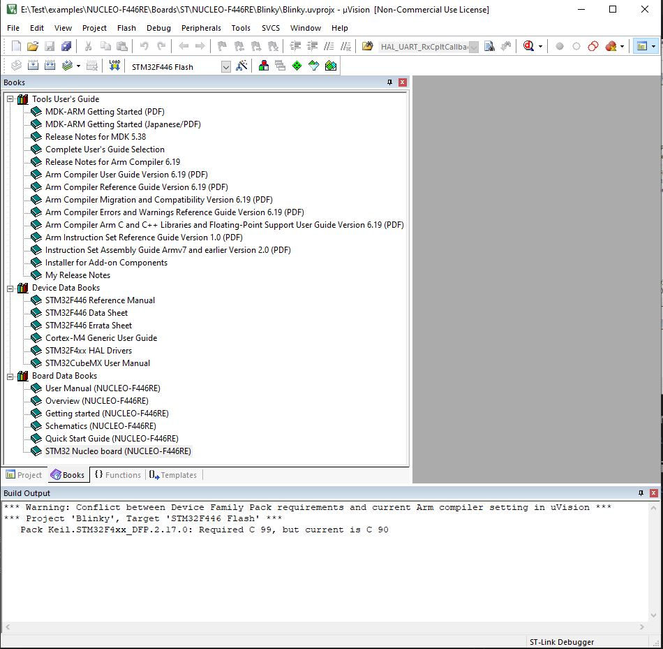

# NUCLEO-446RE - Keil info

STMicroelectronics NUCLEO-F446RE Rev.C [STMicroelectronics NUCLEO-F446RE Rev.C](https://www.keil.com/boards2/stmicroelectronics/nucleo_f446re/)

## Board Data Books - NUCLEO-446RE

| Name                | Pages | Link |
| --------------------| ----- | ---- |
|  User Manual        | 65    | [DM00105823-User-Manual.pdf](Board/DM00105823-User-Manual.pdf) |
|  Overview           |  4    | [Board/DM00105918-Overview.pdf](Board/DM00105918-Overview.pdf) |
|  Getting Started    | 22    | [Board/DM00105928-Getting-Started.pdf](Board/DM00105928-Getting-Started.pdf) |
|  Schematics         |  4    | [Board/MB1136-Schematics.pdf](Board/MB1136-Schematics.pdf) |
|  Quick Start Guide  |  2    | [STM32F446RE-NUCLEO_QSG-Quick-Start-Guide.pdf](Board/STM32F446RE-NUCLEO_QSG-Quick-Start-Guide.pdf) |

## Device Data Books - NUCLEO-446RE

| Name                          | Pages | Link |
| ------------------------------| ----- | ---- |
|  STM32F446 Reference Manual   | 1,347 | [DM00105823-User-Manual.pdf](Board/DM00105823-User-Manual.pdf) |
|  STM32F446 Data Sheet         |   198 | [DM00141306-STM32F446-Data-Sheet.pdf](Device/DM00141306-STM32F446-Data-Sheet.pdf) |
|  STM32F446 Errata Sheet       |    29 | [DM00155929 - STM32F446 Errata Sheet](Device/DM00155929-STM32F446-Errata-Sheet.pdf) |
|  Cortex-M4 Generic User Guide |   277 | [Keil/Device/DUI0553-Cortex-M4-Generic-User-Guide.pdf](Device/DUI0553-Cortex-M4-Generic-User-Guide.pdf) |
|  STM32F4xx HAL Drivers        | 2,123 | [DM00105879-STM32F4xx-Hal-Drivers.pdf](Device/DM00105879-STM32F4xx-Hal-Drivers.pdf) |
|  STM32CubeMX User Manual      |   370 | [DM00104712-STM32CubeMX-User-Manual.pdf](Device/DM00104712-STM32CubeMX-User-Manual.pdf) |
