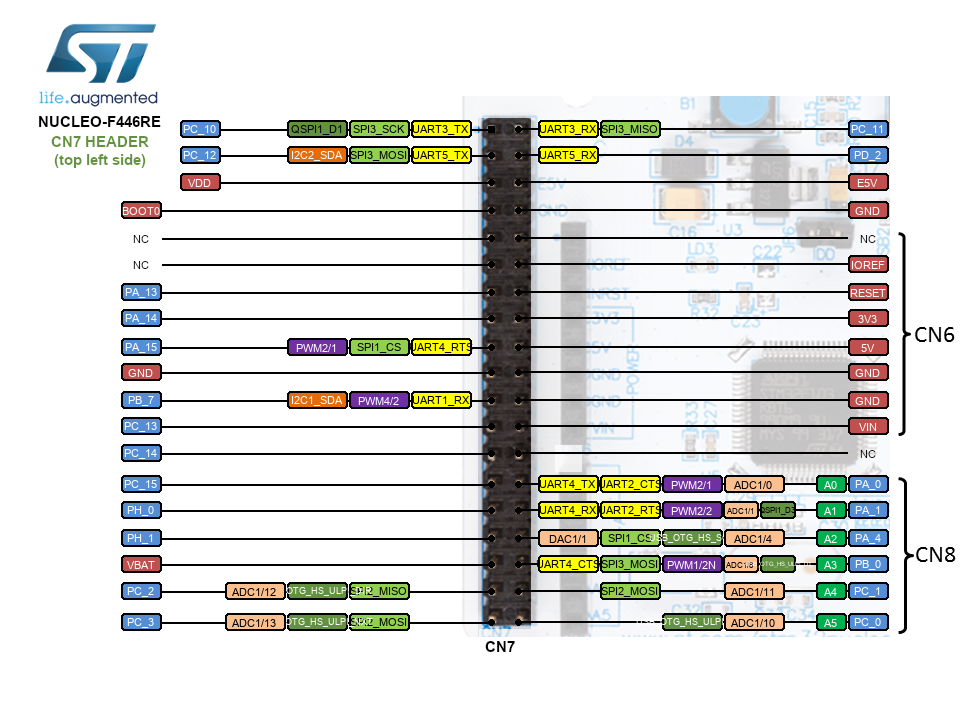
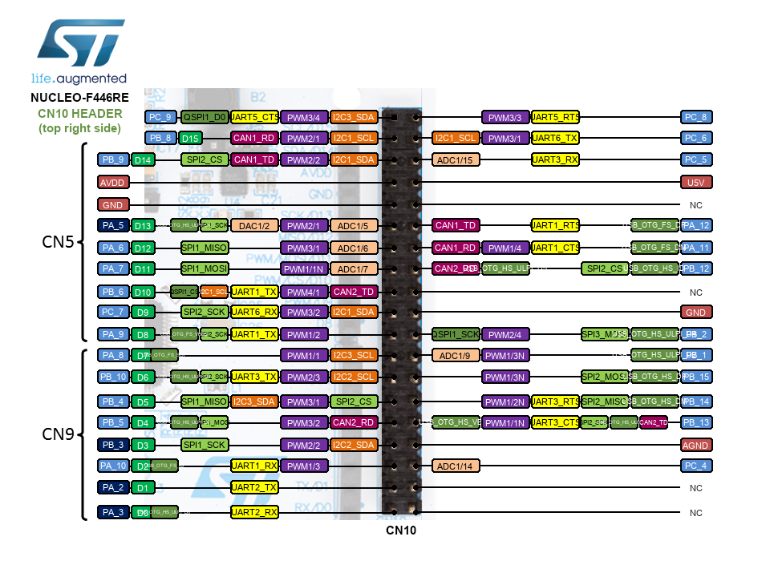
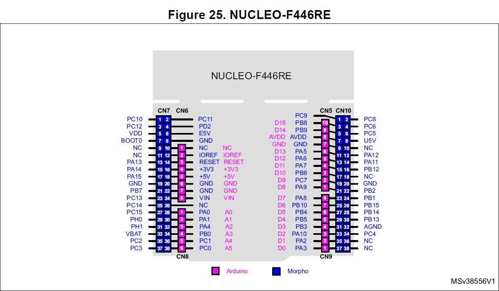

# NUCLEO-446RE

## NUCLEO-446RE Info

* arm mbed [NUCLEO-F446RE](https://os.mbed.com/platforms/ST-Nucleo-F446RE/)

* Left Bank Pinout (CN7) Reference

* Right Bank Pinout (CN10) Reference

* Pinout Reference

## Docs

* nucleo-f446re [nucleo-f446re.pdf](nucleo-f446re.pdf)

* User Manual  [um1724 - stm32-nucleo64-boards-mb1136](um1724-stm32-nucleo64-boards-mb1136-stmicroelectronics.pdf)

* User Manual  [um1724 - getting-started-with-stm32-nucleo-board-software-development-tools](um1727-getting-started-with-stm32-nucleo-board-software-development-tools-stmicroelectronics.pdf)

* Technical Note [tn1235-overview-of-stlink-derivatives](tn1235-overview-of-stlink-derivatives-stmicroelectronics.pdf)

* stm32_eval-tools [stm32_eval-tools_portfolio.pdf](stm32_eval-tools_portfolio.pdf)
