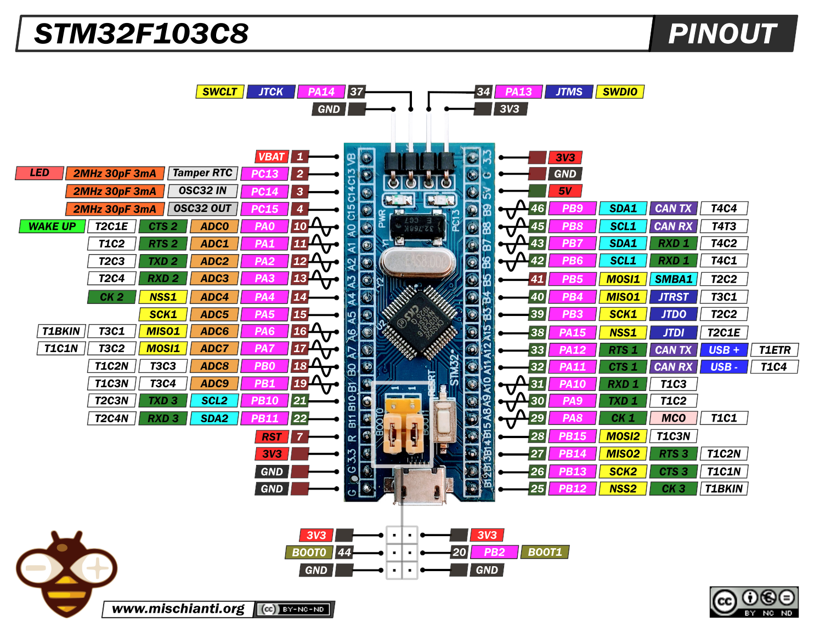

# STM32F103C8T6 (Blue pill)

Introduction-to-STM32-Microcontroller 

## STM32F103C8T6 info

* Pinout Reference

* [Introduction to Programming STM-32 (Blue Pill) Development Board using Arduino IDE](https://www.elementzonline.com/blog/introduction-to-programming-stm-32-blue-pill-development-board-using-arduino-ide)

STM32F103C8T6-pinout 1 Vertical 

STM32F103C8T6-pinout 2 Horizontal 

* [STM32F103C8T6 Blue Pill: high resolution pinout and specs](https://www.mischianti.org/2022/05/15/stm32f103c8t6-blue-pill-high-resolution-pinout-and-specs/) 

## Docs

* Datasheet [cd00161566.pdf](cd00161566.pdf)
